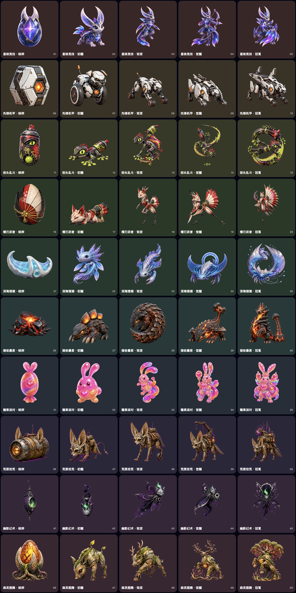

# 芽芽 · CainiaoPet

芽芽是一个原生 macOS 浮动桌宠：它会跟随 Codex 的运行、完成与失败状态做出反馈，也有自己的饥饿、心情、精力、喂养、玩耍、睡眠和五阶段成长。项目采用一个 Swift Package、多个清晰模块，避免桌宠、事件桥接和成长规则分成两个项目后发生数据漂移。

当前版本：`1.2.0`（Build 5），Apple Silicon `arm64`，macOS 14+。

## 已实现

- 原生 macOS 透明浮动窗口、菜单栏入口与本地自动存档
- 核卵、初醒、锐变、觉醒、冠冕五个成长阶段
- 10 条独立物种进化线、50 张 `1254×1254` 透明角色资源
- 饥饿、心情、精力，以及喂食、玩耍、睡觉/唤醒
- Codex 运行、完成、失败状态动画与成长反馈
- 宠物工坊：文字原创、参考图改画风、高相似延展，支持 1–8 阶段
- 草稿 `low`、标准 `medium`、最终 `high` 三档质量与动态费用估算
- 每一阶段拿到 API 原图后立即落盘；失败、取消或退出后可以继续
- 支持从失败阶段续跑、从指定阶段重做、单阶段付费重绘
- 已付费原图可在没有 Key 时单独免费重试本地处理；“继续生成”和“重新请求”作为可能付费的独立操作显示
- 自适应边缘连通抠图，保留粉色、紫色等主体内部颜色
- 原图与抠图结果预览
- 自定义模板重命名、删除、导入、导出、本地替换和 AI 单阶段重绘
- 可选 Codex Hooks；安装和卸载只处理芽芽自己的条目

## 十套内置风格

星核竞技、先锋机甲、街头乱斗、樱刃武者、深海猎潮、熔岩暴君、糖果派对、荒原拾荒、幽影幻术、森灵图腾。

十条进化线分别采用星晶月兔、轮足机械獒、涂鸦壁虎、赤狐鹤、鳐螈蟹、岩甲穿山兽、软糖气球兔、装甲耳廓狐、无脚蛾猫幻灵与古树鹿的独立身体结构。完整造型锚点与五阶段递进规则见 `ArtSources/CHARACTER_BIBLE.md`。

本版重点重画了三条此前连续性较弱的成长线：

- 糖果派对后两阶段继续保留清楚的兔脸、长耳和紧凑轮廓。
- 荒原拾荒五阶段都保持四足耳廓狐，不再转成长腿鸟兽。
- 星核竞技从幼兔、斥候到星弓形态逐级过渡，不再突然由兔形跳到龙形。

下图按接近桌宠实际显示区域的尺寸排列全部 50 个形态，用于检查小尺寸轮廓和阶段连续性：



## 用户自己的 API Key

芽芽不内置开发者 API Key，也不会让安装者共用作者的 Key。每位安装用户如需使用“宠物工坊”的真实图像生成，需要输入并支付自己 OpenAI API 账户产生的调用费用；Key 只保存在该用户自己的 macOS 钥匙串。

不输入 Key 时，浮动桌宠、十套内置成长线、喂养成长、本地存档、Codex 状态联动和已有自定义模板仍可正常使用。

截至 2026-08-10，`gpt-image-2` 的 `1024×1024` 输出费用估算如下；应用确认框会按阶段数动态显示输出部分，参考图和同轮阶段图的输入费用另计：

| 质量 | 单张输出 | 五阶段输出 |
|---|---:|---:|
| 草稿 `low` | `$0.006` | `$0.030` |
| 标准 `medium` | `$0.053` | `$0.265` |
| 最终 `high` | `$0.211` | `$1.055` |

能力和价格应以 [GPT Image 2 模型页](https://developers.openai.com/api/docs/models/gpt-image-2)、[图像生成指南](https://developers.openai.com/api/docs/guides/image-generation) 与 [API 价格页](https://developers.openai.com/api/docs/pricing) 的最新内容为准。

## 本地数据与隐私

宠物状态保存在：

```text
~/Library/Application Support/CainiaoPet/pet-state.json
```

自定义模板和中断任务保存在：

```text
~/Library/Application Support/CainiaoPet/PetTemplates/
~/Library/Application Support/CainiaoPet/GenerationJobs/
```

Codex 联动只分类任务生命周期事件，不保存或展示提示词、回复正文或项目文件内容。日常养成、模板清单、阶段图和事件桥接文件都留在本机。

只有用户主动确认图像生成后，宠物描述、用户选择的参考图以及为维持同一血统所需的前序阶段图才会发送给 OpenAI 图像 API。应用不会把 Codex 对话、代码或任务内容发送给图像 API。

## 构建、检查与本地打包

```bash
./Scripts/run-all-checks.sh
./Scripts/package-release.sh
```

本地打包会生成：

```text
artifacts/CainiaoPet.app
artifacts/CainiaoPet-macOS-arm64.zip
artifacts/CainiaoPet-macOS-arm64.RELEASE.json
artifacts/CainiaoPet-macOS-arm64.zip.sha256
```

发布清单记录版本、构建号、最低系统、架构、源码提交、签名状态、App 文件哈希和 50 张角色资源哈希。打包脚本会拒绝损坏 ZIP、`__MACOSX`、`.DS_Store`、AppleDouble 文件、资源缺失、架构漂移和清单不一致。

GitHub Actions 会在 macOS runner 上重跑全部检查、交叉编译并复验 `arm64` Beta ZIP，确认发布清单的提交号等于当前 workflow 提交且源码状态干净，再把 ZIP、清单和 SHA-256 作为短期 CI artifact 保留。它仍不是公开 GitHub Release，也不会绕过 Developer ID 与 Apple 公证。

本地包默认使用 ad-hoc 临时签名，适合开发验收，不应直接冒充公开发布版本。Developer ID、Hardened Runtime、公证、票据装订和 Gatekeeper 的正式发布流程见 [docs/RELEASING.md](docs/RELEASING.md)。

## 自检范围

```bash
swift run CainiaoPetSelfTest
swift run CainiaoPetAPISelfTest
swift Scripts/verify-character-assets.swift Sources/CainiaoPetApp/Resources/Characters
```

当前共有 27 项本地自检、6 项 API 模拟自检。它们覆盖成长阈值、1–8 阶段规划、模板管理、损坏图片拒绝、整套与单阶段断点恢复、无 Key 本地恢复、明确重新请求、质量费用、抠图颜色保护、50 张透明资源、Codex 事件隐私过滤、Hooks 安全，以及生成/编辑端点的模拟请求与响应。模拟自检不会读取真实 Key，也不会产生 API 费用。
