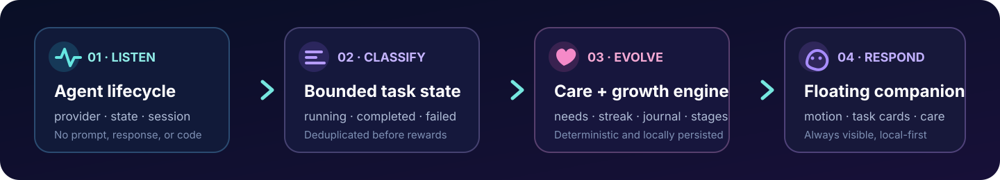
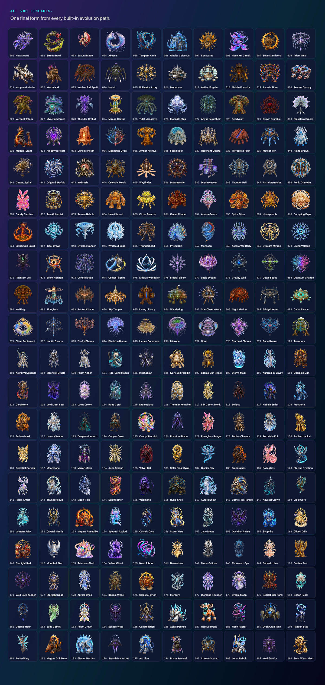
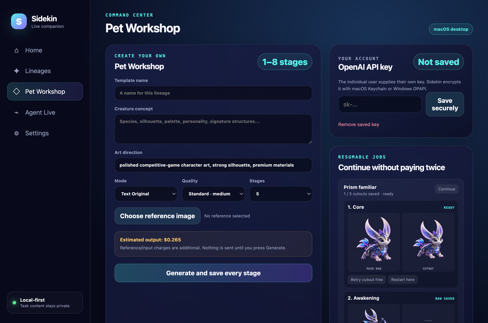

<div align="center">
  <a href="https://github.com/limingrui679-design/Sidekin/blob/0fca27df3ae9e4e32ab37651efb1a8f756912ffb/docs/readme/poster-arena-convergence.png"></a>
</div>

<h1 align="center">Sidekin</h1>

<div align="center">
  
  <br>
  
  
  
  <a href="https://github.com/limingrui679-design/Sidekin/actions/workflows/desktop.yml"></a>
  <a href="https://github.com/limingrui679-design/Sidekin/actions/workflows/codeql.yml"></a>
  
  
  <br><br>
  <strong>A live local desktop companion for Codex and Claude Code.</strong>
  <br>
  Care for one persistent Sidekin, watch it respond to real work, and evolve it through five continuous forms.
  <br><br>
  <a href="#quick-start">Quick start</a> ·
  <a href="#what-makes-sidekin-different">Features</a> ·
  <a href="#visual-gallery">Gallery</a> ·
  <a href="#agent-live">Agent Live</a> ·
  <a href="#privacy-boundary">Privacy</a> ·
  <a href="#verification">Verification</a> ·
  <a href="#contributing">Contributing</a>
</div>

## What makes Sidekin different

Most desktop pets stop at decoration. Sidekin connects a real local care loop to agent lifecycle signals without turning prompts or code into analytics data.

| Live work, not fake activity | Growth with consequences | 200 continuous lineages | Creator-ready Pet Packs |
|---|---|---|---|
| Codex and Claude Code tasks become concurrent timed cards, expressions, and motion changes. | Hunger, mood, energy, care cooldowns, focus streaks, a bounded journal, and monotonic evolution persist locally. | 1,000 audited forms span animals, nonhuman humanoids, mythic beings, deities, mecha, artifacts, habitats, and abstract life. | Build, validate, hash, share, import, and safely unpack data-only 1–8 stage `.sidekinpet` lineages. |


Sidekin does not include the removed hat, face, or aura slot system. Each lineage is a designed identity with its own silhouette, materials, energy motif, locomotion, and motion profile.

## Quick start

Sidekin is a source-first GitHub project. A normal clone includes the optimized runtime catalog; Git LFS is no longer required.

Prerequisite: Node.js 22.12 or newer within the Node 22 LTS line.

```bash
git clone https://github.com/limingrui679-design/Sidekin.git
cd Sidekin
npm ci
npm run verify
npm start
```

Build an unpacked app or ZIP for the current operating system:

```bash
npm run package
npm run make
```

These commands do not publish a release. The macOS source build is ad-hoc signed, not Developer ID signed or notarized; the Windows source build is not Authenticode signed.

## How it works

<p align="center">
  
</p>

The companion path is local: lifecycle metadata updates one deterministic state machine, renderers receive a narrow public view, and state is written atomically to the operating-system application-data directory. The separate Pet Workshop contacts the OpenAI Image API only after the user confirms a request with their own key.

## At a glance

| | Sidekin 2.2 source Beta |
|---|---|
| Platforms | macOS 13+ · Windows 10/11 · 64-bit |
| Runtime | Electron 43 · TypeScript · sandboxed isolated renderers |
| Built-in catalog | 200 lineages · 1,000 transparent 768×768 WebP forms · 200 lazy thumbnails |
| Evolution | Egg → Hatchling → Juvenile → Ascended → Legendary |
| Agent adapters | Official Codex hooks · Claude Code hooks · optional Codex session fallback |
| Motion | 13 lifecycle states shaped by 20 lineage-specific movement profiles |
| Local state | Care, journal, streak, task cards, templates, jobs, settings |
| Credentials | macOS Keychain or Windows DPAPI through Electron `safeStorage` |
| Distribution | Reviewable GitHub source project; no signed consumer-release claim |

## Visual gallery

Arena Convergence is the selected homepage composition. Eight different full-width themes follow so the collection reads as a world, not a row of cutouts. Each preview links to its preserved full-resolution source at the commit-pinned art archive snapshot.

### Cosmic Grand Assembly

[](https://github.com/limingrui679-design/Sidekin/blob/0fca27df3ae9e4e32ab37651efb1a8f756912ffb/docs/readme/hero.jpg)

*Mythic beings, mecha, habitats, artifacts, and abstract life sharing one celestial stage.*

### Evolution Odyssey

[](https://github.com/limingrui679-design/Sidekin/blob/0fca27df3ae9e4e32ab37651efb1a8f756912ffb/docs/readme/poster-evolution-odyssey.png)

*Growth expressed through travel, changing scale, and structurally distinct silhouettes.*

### Prismatic Pet Festival

[](https://github.com/limingrui679-design/Sidekin/blob/0fca27df3ae9e4e32ab37651efb1a8f756912ffb/docs/readme/poster-prismatic-festival.png)

*Bright companions racing, dancing, flying, and colliding across a playful world.*

### Chronicle of Living Worlds

[](https://github.com/limingrui679-design/Sidekin/blob/0fca27df3ae9e4e32ab37651efb1a8f756912ffb/docs/readme/poster-chronicle-ten-worlds.png)

*Creatures, constructs, spirits, and habitats connected as one epic world map.*

### Neon Night League

[](https://github.com/limingrui679-design/Sidekin/blob/0fca27df3ae9e4e32ab37651efb1a8f756912ffb/docs/readme/poster-neon-night-league.png)

*Competitive motion, aggressive perspective, and readable silhouettes at speed.*

### Codex Companion Workshop

[](https://github.com/limingrui679-design/Sidekin/blob/0fca27df3ae9e4e32ab37651efb1a8f756912ffb/docs/readme/poster-companion-workshop.png)

*Care and agent work coexisting inside one inhabited creator workshop.*

### Mythic Dawn Assembly

[](https://github.com/limingrui679-design/Sidekin/blob/0fca27df3ae9e4e32ab37651efb1a8f756912ffb/docs/readme/poster-mythic-dawn.png)

*Monumental nonhuman mythology formed from weather, crystal, plants, and divine machines.*

### Microverse Mayhem

[](https://github.com/limingrui679-design/Sidekin/blob/0fca27df3ae9e4e32ab37651efb1a8f756912ffb/docs/readme/poster-microverse-mayhem.png)

*Tiny societies and living habitats confronting enormous evolved guardians.*

[Open the dedicated gallery](docs/GALLERY.md) for the same nine-poster selection and archive references.

## Five stages, one identity

Every built-in lineage defines a persistent existence type, silhouette logic, material system, energy motif, locomotion class, five named forms, and stage-specific visual anchors.


Progression must change structure—not merely color—while preserving recognizable lineage anchors. Nova keeps one bow-based combat language from compact starbow to crown-scale compass bow. Walking Treehouse advances through rooms, bridges, terraces, and a circular borough rather than becoming a different species.

The visual audit checks common-sense anatomy or construction, identity continuity, species drift, repeated faces or bodies, insufficient stage change, nonhuman-humanoid compliance, cutout quality, unsafe symbols, and readability at desktop-pet size.

## 200 lineages · 1,000 forms


The catalog uses overlapping free-form tags instead of fixed buckets. Search can cross animals, unmistakably nonhuman humanoids, legendary creatures, spirits, deities, racers, guardians, mecha, artifacts, living buildings, botanical beings, and abstract collectives.

### Every built-in lineage

[](https://github.com/limingrui679-design/Sidekin/blob/0fca27df3ae9e4e32ab37651efb1a8f756912ffb/docs/readme/all-200.jpg)

The contact sheet is generated from the same catalog and accepted final assets used by the app. Humanoid silhouettes remain deliberately nonhuman: the art standard excludes real people, children, realistic human skin, ordinary human faces, and realistic human hair.

Review evidence:

- [`docs/LINEAGE_AUDIT.md`](docs/LINEAGE_AUDIT.md) — one result for each original lineage
- [`docs/EXPANSION_AUDIT.md`](docs/EXPANSION_AUDIT.md) — one result for each expansion lineage
- [`ArtSources/PET_THEME_CATALOG.json`](ArtSources/PET_THEME_CATALOG.json) — machine-readable source of truth
- [`ArtSources/ART_PRODUCTION.md`](ArtSources/ART_PRODUCTION.md) — continuity and production contract
- [`docs/ART_ARCHIVE.md`](docs/ART_ARCHIVE.md) — commit-pinned full-PNG corpus, audit sheets, poster sources, and rebuild path

## Care, growth, and motion

- Hunger, mood, and energy continue across launches and bounded offline time.
- Feed, play, sleep, and wake have meaningful conditions and cooldowns; button states explain when care is unavailable.
- Completed work grants growth once per unique agent turn; failure grants small non-punitive growth.
- Active-day streaks, temperament, and a bounded growth journal reflect how the companion is raised.
- Evolution is monotonic across five thresholds and never loses an earned form.
- Stale running cards become `interrupted` after two hours instead of leaving the pet permanently “working.”
- Thirteen lifecycle motions combine with 20 profiles: agile, bouncing, buoyant, flowing, gliding, heavy, marching, mechanical, orbiting, poised, prowling, pulsing, rolling, rooted, serpentine, skittering, spectral, swarming, swimming, and winged.
- `prefers-reduced-motion` disables continuous animation without removing state information.

## Agent Live

Sidekin supports independent local adapters for Codex and Claude Code. Both can be connected or removed without deleting unrelated hooks.

### Codex

Sidekin writes only its handlers to `~/.codex/hooks.json` for `UserPromptSubmit` and `Stop`. Codex requires non-managed command hooks to be reviewed and trusted; after connecting, use `/hooks` if Codex asks for review. Hook input includes lifecycle identifiers and working directory, but Sidekin persists only provider, status, time, session/turn identifiers, and the final path component used as a workspace label. See the [official Codex hooks documentation](https://learn.chatgpt.com/docs/hooks).

An optional session fallback recognizes a small set of lifecycle records when hooks are unavailable. It is off by default because Codex documents transcript format as unstable; parsing is bounded, read-only, and never stores message content.

### Claude Code

Sidekin adds isolated `UserPromptSubmit`, `Stop`, `StopFailure`, and `SessionEnd` command hooks to `~/.claude/settings.json`. The bridge emits no prompt-visible text and keeps only the same bounded lifecycle metadata. See the [Claude Code hooks guide](https://code.claude.com/docs/en/hooks-guide) and [hooks reference](https://code.claude.com/docs/en/hooks).

## Pet Workshop and Pet Pack SDK

Pet Workshop supports Text Original, Reference Restyle, and High-Fidelity Reference modes; one to eight stages; low, medium, and high quality; dynamic confirmation estimates; immediate paid-raw persistence; resume; restart-from-stage; single-stage regeneration; free local reprocessing; adaptive edge-connected background removal; and complete template management.



The optional image path uses the individual user's own OpenAI API key and OpenAI API account. Sidekin has no shared developer key. The key is protected by Keychain or DPAPI. A selected reference path stays inside the trusted main process behind a short-lived token; after Sidekin makes a normalized local copy, the original path and file name are not persisted or exposed to the renderer.

Pet Pack schema 2 adds author, license, minimum Sidekin version, a motion profile, monotonic thresholds, and SHA-256 hashes. Packages are data-only and reject code, undeclared entries, traversal paths, duplicate ZIP names, corrupt images, unsafe sizes, and hash mismatches.

```bash
npm run pet-pack -- init ./my-sidekin
npm run pet-pack -- validate ./my-sidekin
npm run pet-pack -- pack ./my-sidekin ./my-sidekin.sidekinpet
```

See the complete [`Pet Pack SDK guide`](docs/PET_PACK_SDK.md). Schema-1 local templates migrate automatically.

Because model capabilities and prices change, consult the current [OpenAI image model documentation](https://developers.openai.com/api/docs/models), [image generation guide](https://developers.openai.com/api/docs/guides/image-generation), and [API pricing](https://developers.openai.com/api/docs/pricing). Verification uses simulated clients and never incurs an API charge.

## Privacy boundary

| Data or action | Leaves this computer? |
|---|---|
| Care, growth, streak, journal, selected lineage, settings, and task cards | No |
| Codex or Claude Code prompts, replies, code, tool output, and project files | No — Sidekin does not persist them |
| Provider, lifecycle state, time, turn/session ID, and workspace basename | No |
| Custom templates, Pet Packs, raw stages, processed stages, and resumable jobs | No |
| User API key | Only to `api.openai.com` after a confirmed image request; encrypted locally |
| Confirmed generation description and required image references | Yes — only after explicit confirmation |

```text
macOS:   ~/Library/Application Support/Sidekin/
Windows: %APPDATA%\Sidekin\
```

Legacy pre-Sidekin application data is migrated only when the Sidekin directory does not already exist.

## Architecture

```text
Electron main process
├── deterministic lifecycle   care, decay, streaks, journal, evolution
├── agent adapters            Codex hooks/fallback and Claude Code hooks
├── secure preload            narrow typed API and exact sender validation
├── control renderer          care, catalog, Agent Live, workshop, settings
├── floating renderer         transparent pet, hit testing, profiles, cards
├── creator services          image API, cutout, recovery, Pet Pack storage
└── platform adapters         windows, tray, paths, Keychain/DPAPI, packaging
```

Renderers are sandboxed with context isolation, no Node integration, exact trusted file origins, denied permissions, denied popups, blocked remote navigation, CSP, and runtime validation on every mutating IPC path. The app enforces one running instance and clamps saved floating-window bounds after display changes.

## Verification

```bash
npm run verify       # lint, types, tests, build, 1,200 assets, contracts, real Electron E2E
npm run assets:verify
npm run package      # current-OS unpacked app
```

Automated coverage includes malformed-state migration and backup recovery, care cooldowns, offline bounds, concurrent Codex/Claude tasks, deduplication, stale-task recovery, streaks, hook preservation, metadata minimization, pink/purple-safe cutout, paid-stage resume, reference-path removal, corrupt-template isolation, transparent-stage enforcement, Pet Pack tamper/version rejection, bounded image-service responses, runtime and packaged-asset hashes/dimensions/budgets, renderer security, accessibility contracts, and actual Electron screenshots of Home, floating pet, Workshop, and Settings.

The GitHub Actions matrix runs on native `macos-latest` and `windows-latest`, executes the same source verification, packages the current platform, rechecks all 1,200 packaged asset hashes plus archive contents and size budgets, and uploads temporary workflow artifacts. It does not create or claim a signed public release.

## Repository guide

| Path | Purpose |
|---|---|
| [`src`](src) | Shared Electron runtime, lifecycle, adapters, secure preload, renderers, and workshop |
| [`tests`](tests) | Cross-platform unit, integration, security, migration, recovery, and Pet Pack tests |
| [`RuntimeAssets`](RuntimeAssets) | 1,000 optimized runtime forms, 200 thumbnails, and a provenance/hash manifest |
| [`ArtSources`](ArtSources) | Text catalog, prompts, continuity standards, and expansion ledger |
| [`Scripts`](Scripts) | Builds, runtime-asset converter/verifier, Pet Pack CLI, E2E, packaging, and audits |
| [`docs/ART_ARCHIVE.md`](docs/ART_ARCHIVE.md) | Recoverable full-resolution source-art boundary |
| [`docs/COMPLETION_AUDIT.md`](docs/COMPLETION_AUDIT.md) | Requirement-to-evidence audit |
| [`docs/RELEASING.md`](docs/RELEASING.md) | Source build, CI artifacts, and signing boundary |
| [`docs/PRIVACY.md`](docs/PRIVACY.md) | Data inventory, retention, deletion, and network boundary |
| [`docs/THREAT_MODEL.md`](docs/THREAT_MODEL.md) | Trust boundaries, threats, mitigations, and residual risks |
| [`THIRD_PARTY_NOTICES.md`](THIRD_PARTY_NOTICES.md) | Runtime dependency licenses and packaged notice locations |
| [`.github/workflows/desktop.yml`](.github/workflows/desktop.yml) | Native macOS and Windows verification matrix |

## Contributing

Start with [`CONTRIBUTING.md`](CONTRIBUTING.md), then use the structured bug or
feature form. Pull requests must pass `npm run verify`, preserve the local-first
privacy boundary, include rights information for every new visual asset, and
avoid secrets or paid API evidence. Security reports belong in a private
[GitHub security advisory](https://github.com/limingrui679-design/Sidekin/security/advisories/new),
not a public issue. See [`SUPPORT.md`](SUPPORT.md) for the support boundary and
[`CODE_OF_CONDUCT.md`](CODE_OF_CONDUCT.md) for community expectations.

## Project status

Sidekin 2.2.0-beta.1 is a locally verified macOS and Windows source Beta. The shared runtime has been packaged and launched on macOS; Windows behavior is exercised through shared tests and the native Windows CI/package gate. The project is not represented as a notarized macOS product, an Authenticode-signed Windows product, a public consumer installer, external adoption, or an author-funded real-API end-to-end test.

The repository remains proprietary and all rights are reserved. Source and art are visible for review, but the repository [`LICENSE`](LICENSE) does not grant permission to copy, redistribute, or create derivatives. Pet Pack authors choose and declare the license for their own pack content.

Bundled dependencies retain their own terms; runtime licenses and notice locations are recorded in [`THIRD_PARTY_NOTICES.md`](THIRD_PARTY_NOTICES.md) and copied into every desktop package.

## Acknowledgements

The repository presentation follows durable patterns seen in strong desktop and companion projects: visual identity first, a copyable start path, product proof near claims, explicit privacy and platform boundaries, contributor-facing extension docs, and reproducible checks. Sidekin's copy, code, catalog, and visual assets are project-specific.
