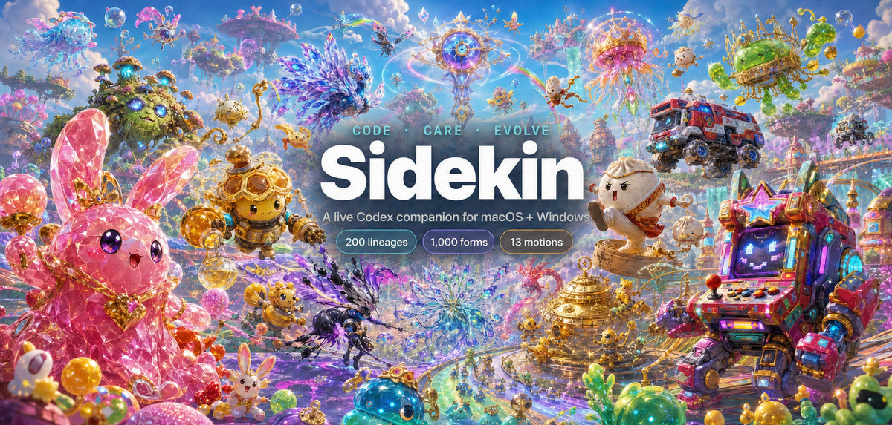
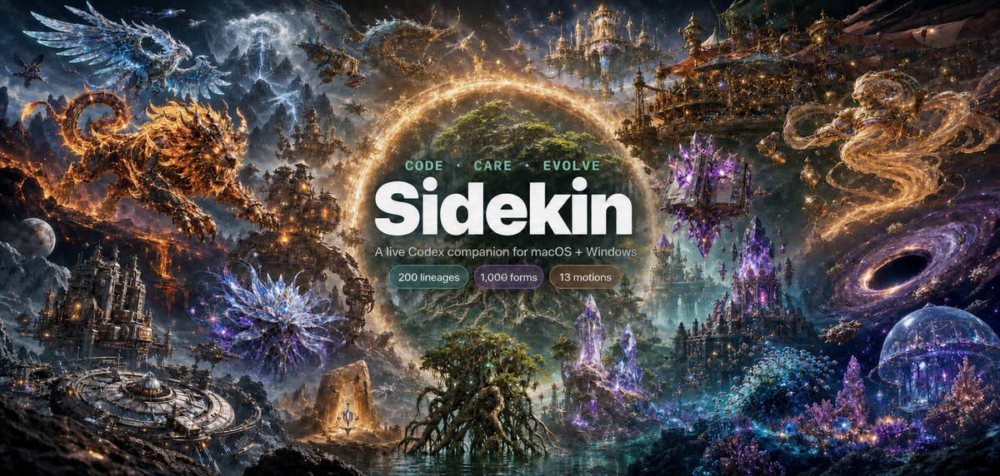
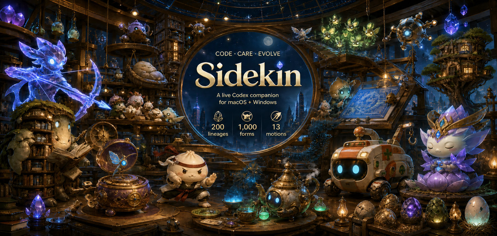

# Sidekin visual gallery

[Back to the project README](../README.md)

The homepage uses Arena Convergence as its main poster. Eight supporting compositions below present different subjects and product moods. Each lightweight preview links to its preserved full-resolution source.

## Selected homepage poster

### Arena Convergence

*Kinetic competitive ensemble with strong foreground scale, readable branding, and broad catalog representation.*

## Eight supporting themes

### Cosmic Grand Assembly

*A starfield ensemble spanning mythic beings, mecha, architecture, artifacts, and abstract life.*

### Evolution Odyssey

*Growth and transformation moving through one connected world.*

### Prismatic Pet Festival

*Bright companionship, racing, dancing, and playful scale changes.*

### Chronicle of Living Worlds

*Contrasting creatures, constructs, spirits, and habitats joined into one epic world map.*

### Neon Night League

*High-speed competitive action across a neon creature arena.*

### Codex Companion Workshop

*Feeding, rest, play, study, and live task response inside one shared workshop.*

### Mythic Dawn Assembly

*Monumental nonhuman mythology formed from plants, crystal, weather, and divine constructs.*

### Microverse Mayhem

*Tiny societies, living habitats, and enormous evolved guardians.*

These are alternate presentations of the same audited catalog, not additional products, releases, or user deployments. Character-level provenance and acceptance evidence remain in the [original lineage audit](LINEAGE_AUDIT.md), [expansion audit](EXPANSION_AUDIT.md), [production standard](../ArtSources/ART_PRODUCTION.md), and machine-readable [theme catalog](../ArtSources/PET_THEME_CATALOG.json).
